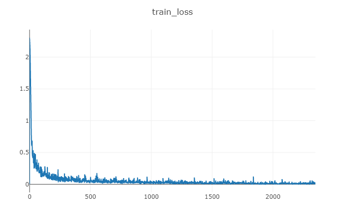
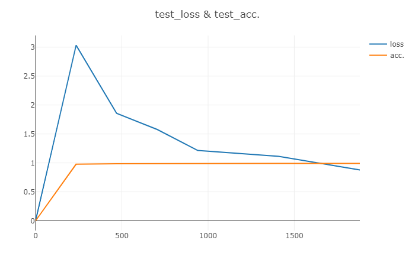
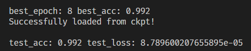
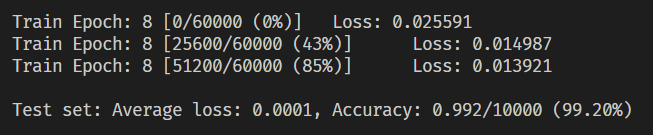

# LeNet5_FPGA
## 项目描述
东南大学微电子学院
《FPGA-DNN加速器设计和应用》课程
课程实验

FPGA实现LeNet5

## tag
v0.1.0 cpu训练版本，可运行。
v0.1.1 修复注释错误。
v0.1.0 完善README。

## TODO 文件目录
resource
visdom-master.zip : visdom git 安装包
visdom_static-master.zip : visdom static 替换文件夹
train_loss.png 
test_loss&acc.png
## 实验一 LeNet5网络训练、参数定点化及前向推理仿真代码
### 运行方法
1、安装pytorch环境

2、安装visdom（可能出现的问题详见 DebugLog BUG001）
```
pip install visdom
```
或者通过resource内的github安装包安装，
[visdom github链接](https://github.com/fossasia/visdom)。

3、训练神经网络
首先一个终端开启visdom服务保持运行，可视化训练过程。
```
python -m visdom.server
```
浏览器打开**localhost**链接

LeNet5_Pytorch文件夹下 开始训练
```
python train.py
```

4、数据集以及参数处理

LeNet5_Pytorch文件夹下 开始处理

数据集导出到txt
```
python convert_mnist_to_json.py
python MINIST_json_to_txt.py
```
提取参数
```
python param_extraction.py
```
至此特征图和参数分别处理完毕，保存至pix_norm.txt和param_text中。

5、特征图以及参数量化

LeNet5_Pytorch文件夹下 开始量化
```
python float2fixed.py
```
至此特征图和参数分别量化完毕，保存至pix_norm_bin.txt和weights_and_bias_bin.txt中。


### 运行结果




可以看出最佳模型在第8轮，测试集上模型结果准确率达到99.2%，损失为0.0001。

TODO 修改文件结构，把特征图参数放一起。